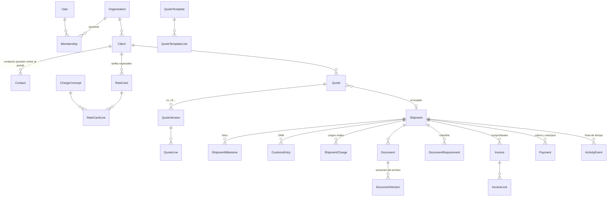

# Forwarder v2 — modelo de datos

Documento para validar el modelo antes de construir las pantallas. El esquema completo está en [`prisma/schema.prisma`](../prisma/schema.prisma).

## Principios

1. **Multiempresa desde el día uno.** Cada agencia es una `Organization`. Todo dato de negocio lleva `organizationId`, y los valores únicos (RUC de cliente, N° de cotización, códigos de concepto) son únicos *dentro* de cada agencia. Dos agencias pueden tener al mismo importador como cliente.
2. **El embarque es el eje.** La cotización vende; al aceptarse genera el **embarque** (`Shipment`), que concentra hitos, documentos, aduana, cargos y cobranza.
3. **Lo enviado no se edita.** Una cotización tiene versiones (v1, v2…). La versión enviada o aceptada queda congelada; cambiar precios crea una versión nueva.
4. **Un solo estado del embarque**, con hitos que lo mueven y dejan historial con fecha.
5. **Dinero exacto.** Montos en decimal (no flotante); USD y PEN nunca se mezclan en un mismo total ni en un mismo comprobante.
6. **Correlativos atómicos** (`NumberSequence`): COT-2026-0001, F001-123 y embarques con prefijo por modo (L = LCL, M = FCL, A = aéreo, T = terrestre) y un solo correlativo por año, como en el sistema anterior. Nunca se cuentan filas.
7. **Historial y avisos.** Todo lo importante queda en `ActivityEvent`. Lo marcado como visible para el cliente aparece en su portal y puede generar un aviso (`NotificationOutbox`: correo hoy, WhatsApp después).

## Mapa general

## Cómo se arma una cotización rápida

**Plantillas** (`QuoteTemplate`): por tipo de servicio, con los conceptos que casi siempre van. Cada línea puede depender del **incoterm**: "Gastos EXW" solo aparece si la cotización es EXW, y el flete internacional solo cuando lo paga el importador (EXW, FCA, FAS, FOB). Las opcionales se muestran aparte y no suman al total. Vienen cinco de partida (editables):

| Plantilla | Conceptos (en orden) | Opcionales |
|---|---|---|
| Importación marítima LCL | Gastos EXW *(solo EXW)*, flete internacional LCL por W/M *(EXW/FCA/FAS/FOB)*, visto bueno, descarga, comisión de agencia de aduanas, almacén, transporte local, gastos operativos | Documentación en origen *(EXW/FCA)*, seguro, aforo físico, inspección previa |
| Importación marítima FCL | Igual que LCL sin descarga; flete por contenedor y transporte por contenedor | Igual que LCL |
| Importación aérea | Gastos EXW *(solo EXW)*, flete por kg cobrable, comisión, almacén, transporte local, gastos operativos | Igual que LCL |
| Solo despacho de importación | Comisión, gastos operativos | Almacén, transporte local, aforo físico, inspección previa |
| Exportación marítima FCL | Transporte, comisión, gastos operativos, emisión de BL, flete | Seguro |

La plantilla LCL sigue el orden que usa Marivan; FCL y aérea son una adaptación pendiente de confirmar.

**Tarifarios** (`RateCard` + `RateCardLine`): cada línea dice concepto, unidad de cobro, moneda, costo y/o precio, mínimos y, si quieres, filtros (origen, destino, naviera, tipo de contenedor, tramo de peso/volumen) y vigencia.

- Sin cliente → **tarifa general**.
- Con cliente → **tarifa especial de ese cliente**.
- Con proveedor (naviera, agente) → **tarifa de costo** de ese proveedor.

Al cotizar, por cada concepto se elige la tarifa **más específica que esté vigente**: la del cliente gana siempre; después la que coincide con la ruta y la naviera; después la general; y si no hay ninguna, el precio por defecto del concepto. Si solo hay costo, el precio se sugiere con el margen de la empresa (15% por defecto).

**Unidades de cobro** (la cantidad se calcula sola con los datos de la carga):

| Unidad | Cálculo |
|---|---|
| Por embarque / por BL | 1 |
| Por contenedor | N° de contenedores (opcionalmente de un tipo) |
| Por W/M | mayor entre toneladas y m³ (LCL) |
| Por m³ · por tonelada · por kg | directo |
| Por kg cobrable | mayor entre peso real y volumétrico (1 m³ = 166,67 kg) |
| Por bulto · por día | directo |
| % FOB · % CIF | porcentaje del valor de la mercadería |
| Manual | se digita |

Además: cantidad mínima (p. ej. mínimo 1 W/M) y monto mínimo (p. ej. 0,30% CIF, mínimo USD 150).

**Totales** por moneda: gravado, IGV (tasa de la empresa, 18% por defecto), exonerado/inafecto, reembolsos, total, costo y margen. Las líneas opcionales se muestran pero no suman.

## Estados del embarque y hitos

Estado general: Orden confirmada → En origen → En tránsito → En destino → En despacho → Levante → En reparto → Entregado → Cerrado (o Anulado).

Los **hitos** se copian al crear el embarque según dirección, modo y servicios contratados. Al completar un hito con fecha, el estado avanza y, si el hito lo indica, se avisa al cliente con un texto pensado para él ("Tu carga llegó a destino").

- **Importación:** recojo en origen · pre-alerta recibida · zarpe · arribo · DAM numerada · canal asignado · tributos pagados · levante · salida a almacén · entregado · devolución del contenedor (FCL).
- **Exportación:** booking · carga en terminal · DAM numerada · canal · embarcado · BL emitido · arribo · DAM regularizada.
- **Cierre:** liquidación final enviada.

Los datos de aduana tienen su propia ficha (`CustomsEntry`): régimen, aduana, N° de DAM, canal y fecha, levante y tributos (ad valorem, IGV, IPM, ISC, percepción).

## Documentos

Cada documento tiene:

- **Tipo** configurable, que define quién lo sube, si el cliente lo ve por defecto y para qué embarques se pide en el checklist.
- **Visibilidad:** *Interno* (solo la agencia) o *Cliente*.
- **Estado:** Borrador → Para aprobación del cliente → Cambios solicitados → Final (o Anulado).
- **Versiones:** subir de nuevo no borra el archivo anterior.
- Puede ser del **embarque** o del **cliente** (ficha RUC, vigencia de poder), y saber si lo subió la agencia o el cliente.

**Regla del portal:** el cliente ve los documentos de visibilidad *Cliente* que estén *Final* o *Para su aprobación*, y los que él mismo subió. Nada más.

## Facturación y cobranza

- `ShipmentCharge`: cargos reales del embarque (los de la cotización aceptada más los extra). Los extra pueden requerir aprobación del cliente; los que se piden como anticipo se marcan.
- `Invoice`: un comprobante en una sola moneda (factura, boleta, notas, liquidación de reembolso), con campos para el proveedor de facturación electrónica.
- `Payment`: anticipos, pagos y devoluciones, ligados al embarque y, si corresponde, al comprobante.

## Qué se trae del sistema actual

El sistema anterior no se toca: sigue en el esquema `public` de la misma base Neon. Lo nuevo vive en el esquema `app`. El importador (`npm run legacy:import`) solo lee, corre todo en una transacción y se puede ensayar con `--dry-run`.

| Antes | Ahora |
|---|---|
| Perfil de empresa | `Organization` (Marivan) |
| Cliente | `Client` + contacto principal (`Contact`) |
| Notas del cliente | `ActivityEvent` (nota interna) |
| Catálogo de conceptos | `ChargeConcept` (se fusiona con los conceptos por defecto, sin duplicar) |
| Puertos y terceros | `Location` y `Partner` |
| Cotización + ítems | `Quote` + versión 1 + líneas, con el mismo número. Peso, volumen, contenedores y fechas que estaban como texto se convierten a datos; lo que no se entiende queda en observaciones |
| Cotización aceptada con operación | `Shipment` con su código M-2026-…, estado, BL, fechas, canal, cargos, pagos, documentos, hitos y checklist |
| Expediente | Su código queda como referencia en la cotización |
| Factura SUNAT y recibo simulados | No se importan (eran de prueba) |

Además, el importador compara el total de cada cotización con el que guardaba el sistema anterior y avisa si no cuadra.

## Pendiente de definir contigo

- Tus tarifas reales: cuáles son generales y cuáles por cliente, y con qué unidad se cobra cada una.
- La lista de conceptos que siempre van en tus cotizaciones marítimas (para dejar las plantillas exactas).
- El tratamiento de IGV por concepto: hoy origen, flete y seguro van como reembolso, y los gastos locales como gravados, igual que en el sistema actual.
- El proveedor de facturación electrónica (OSE/PSE) que usarás.
